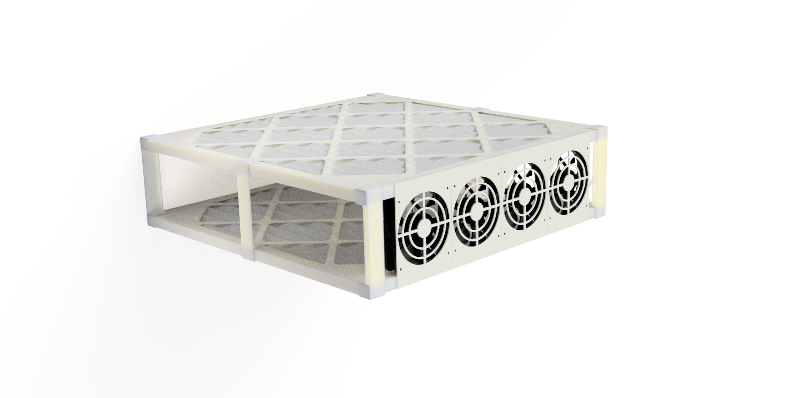

A Corsi-Rosenthal style air filter using only 2 3M MERV filters for a slimmer design.
It uses 120mm PC fans which are very quiet while having very good air flow.
You could add as many fans to a box as you would like depending on the CFM of your fans and the max air flow rating of your filters.
4 typical quiet 1100 RPM PC fans give you around 220 CFM.
Use fans that have the big old 4-Pin Molex connector because those can be daisy chained without additional hardware.

The idea is that you give the two filters structure with the clips, add the fans, ideally with some double sided tape on the faces that meet the filter.
Then wrap the whole thing in duct tape and poke a hole somewhere to feed the fan wire through or add a panel mount DC barrel jack and attach the wires of your fan assembly to it.

I let the wires hang down but you might want to secure them if you have fans on the side.

